 
#Exploratory Data Analysis Project
  
##Introduction
  
  This project is  a part of Exploratory Data Analysis course. Here, we have used one of the curated data sets, provided by Udacity. It is the **prosper loan** data set, that contains information about loan listings and related variables including borrower as well as lender information. It contains variables related to Borrower such as credit rating, prosper rating etc. Moreover, the dataset also has lender information.


First, we load the loan dataset and obtain its size.


```
## [1] 113937     81
```

##Objective

This dataset **loan** has 81 variables, but all of them do not require to be analyzed. When borrowers apply for a loan at Prosper, it is inevitable that borrowers will be concerned about the Annual Percentage Rate(APR) that will be charged for the loan. The APR gets affected by several factors, and we intend to explore those variables in present analysis. For this project, we plan to answer following questions;

* Find the variables, that help to decide the **Borrower APR** while granting a loan, and
* Next, identify variables which affect **prosper grade** for a given borrower.

##Variable Selection for Analysis

Few variables that will be anlayzed here include,


* **BorrowerAPR**: The Borrower's APR for the loan. Every borrower is concerned about the APR, he/she will be charged for the loan, hence it is crucial to study it.
* **ProsperGrade**: The Prosper Rating assigned at the time the listing was created, between AA - HR. The rating assigned by Prosper helps to decide the APR the borrower should be charged.
* **CreditGrade**: The Credit rating that was assigned at the time the listing went live. Overall credit grade is important to judge the credit worthiness of a borrower.
* **InquiriesLast6Months**: Number of inquiries in the past six months at the time the credit profile was pulled. Borrowers who are in desperate need of money tend to make several inquiries to the Credit Bureau, hence, should be analyzed.
* **Bank Card Utilization** : The percentage of available revolving credit that is utilized at the time the credit profile was pulled. Higher balance on the credit card indicates borrower's inability to pay off debts.
* **EstimatedLoss** : Estimated loss is the estimated principal loss on charge-offs. Applicable for loans originated after July 2009. Borrowers are often cautious in investing money in ventures with high loss, hence estimated loss is crucial.
* **OnTimeProsperPayments** : Number of on time payments the borrower had made on Prosper loans at the time they created this listing. This value will be null if the borrower has no prior loans. Borrowers who have made payments on time are rated highly by credit agencies.
* **DebtToIncomeRatio** : The debt to income ratio of the borrower at the time the credit profile was pulled. This value is Null if the debt to income ratio is not available. This value is capped at 10.01. The ratio of debt to income indicates spending habits of the borrower.
* **LoanAmount** : The origination amount of the loan.
* **IncomeRange** : The income range of the borrower at the time the listing was created. It is highly probable that high earning borrowers will be granted higher loan amount. 
* **StatedMonthlyIncome** : The monthly income the borrower stated at the time the listing was created. Similar to **IncomeRange**, monthly income gives information about the credibility of the borrower.
* **Borrower State** : The two letter abbreviation of the state of the address of the borrower at the time the Listing was created. We plan to investigate the percentage of defaulters across the country. To this end, percentage of defaulters for each state need to be calculated.
* **Loan Status**: The current status of the loan: Cancelled,  Chargedoff, Completed, Current, Defaulted, FinalPaymentInProgress, PastDue. The PastDue status will be accompanied by a delinquency bucket. This variable needs to be investigated to determine loan performance at state level. 


##Univariate Analysis

###BorrowerAPR and its Predictors
To begin with, we look at the distribution for **BorrowerAPR**. It is a continuous variable, hence a histogram will be suitable choice. First, it helps to look at some descriptive statistics for **BorrowerAPR**.


```
##    Min. 1st Qu.  Median    Mean 3rd Qu.    Max.    NA's 
## 0.00653 0.15630 0.20980 0.21880 0.28380 0.51230      25
```

We notice that mean is almost same as median, suggesting a normal distribution, which can also be checked from the following histogram.

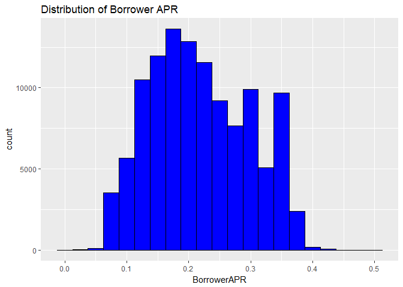<!-- -->

As expected the distibution is roughly normal, except couple of peaks on right side of mean.Since we observed few *NA's* in the above statistics, it is advised to filter out those rows. Non *NA* values for **BorrowerAPR** are stored in `` loan_BorrowerAPR_complete ``. 


Next, we look at some variables, which are likely to affect the **BorrowerAPR** i.e.
**CreditGrade**, **ProsperRating**, and **InquiriesMadeWithinLast6Months**. We begin with **CreditGrade**. Since it is a categorical variable, it will be beneficial to look at the bar graph.

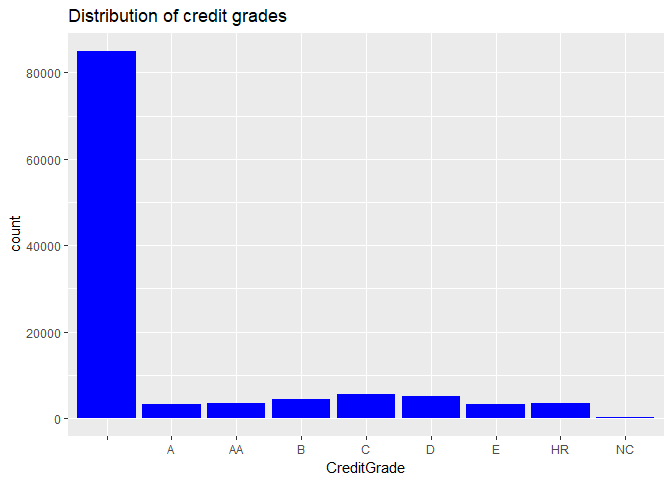<!-- -->

Blank values dominate the distribution. We saw in variable definitons that
**CreditGrade** is populated only for listings prior to year 2009. Therefore, it is advisable to check distribution prior to year 2009.

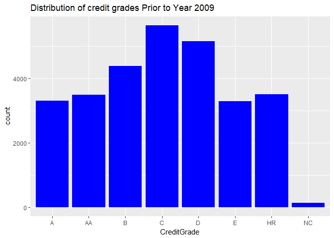<!-- -->

If we observe the count for each **CreditGrade**, we observe that count of `` NC `` (no credit) is very small. This implies that only a handful borrowers were not graded at the time of the listing.


```
## 
##           A    AA     B     C     D     E    HR    NC 
## 84984  3314  3495  4387  5646  5152  3288  3506   140
```


We filter values for CreditGrade in the variable,  `` loan_BorrowerAPR_complete_credit_grade ``. This dataset will be used to explore the bivariate relation between **BorrowerAPR** and **CreditGrade**.

Another variable, that might potentially affect **BorrowerAPR** is **ProsperRating**.


```
##           A    AA     B     C     D     E    HR 
## 29084 14551  5372 15581 18345 14274  9795  6935
```

Since it is a categorical variable, we will look at its bar graph. We also need to filter out the blank values.

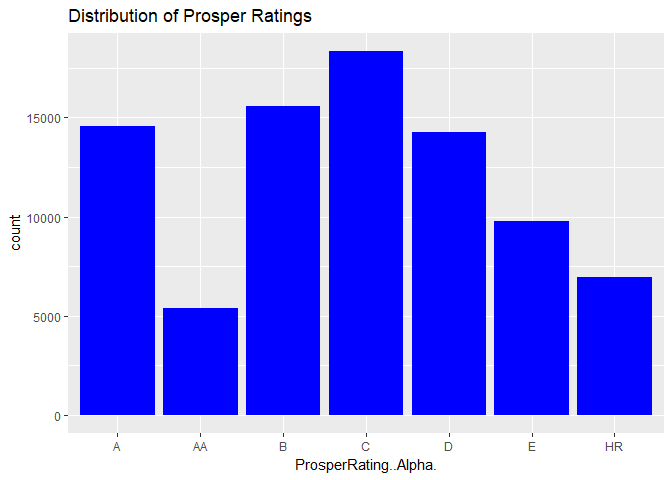<!-- -->

The nonempty values for **ProsperRating** are stored in `` loan_BorrowerAPR_complete_prosper_rating ``. This new dataset will be used to study bivariate analysis between **BorrowerAPR** and **ProsperRating**.

Next, we look at the variable; **InquiriesLast6Months**. While deciding the APR for a loan, it is quite common to study the number of bureau inquiries made by the borrower.


```
##    Min. 1st Qu.  Median    Mean 3rd Qu.    Max.    NA's 
##   0.000   0.000   1.000   1.435   2.000 105.000     697
```
 
Though **InquiriesLast6Months** is not exactly continuous, we can display it as histogram. Before defining the new variable, we make sure to filter the  *NA* values. First, we filter out *NA* values, and store in the new variable `` loan_BorrowerAPR_complete_Inquiries ``.


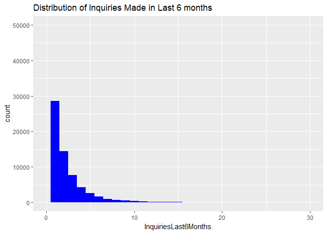<!-- -->

Most of the listings have number of inquiries
less than 10. Moreover, we observe right skewness in the distribution. We conclude that frequent inuqiries to the bureau have not been made in recent six months.


We did univariate analysis for the variable **BorrowerAPR** and variables, that might affect it. Using information regarding missing values, we defined new datasets, `` loan_BorrowerAPR_complete_credit_grade ``, `` loan_BorrowerAPR_complete_prosper_rating ``, and `` loan_BorrowerAPR_complete_Inquiries ``. We will revisit these datatsets while exploring the relationship between **BorrowerAPR** and its possible predictors. Next, we explore the behavior for **ProsperRating** and its possible predictors. 


###ProsperRating and its Predictors

In this section, we analyze the distribution for **ProsperRating..Alpha.**. 


```
## [1] ""   "A"  "AA" "B"  "C"  "D"  "E"  "HR"
```

Since it is  a categorical variable, bar graph seems to be an ideal choice to look at its distribution, that had been analyzed above in the figure titled **Distribution of Prosper Ratings**. As expected, we filter out the blank values and define a new variable, `` loan_Prosper_Rating_complete ``. 


Next, we explore the variables that might possibly affect **ProsperRating**, such as **Bank Card Utilization**, **InquiriesLast6Months**,
**Estimated Loss**, **OnTimeProsperPayments**, and **Debt to Income Ratio**.

We begin with **BankCardUtilization**, which gives information about the credit card usage behavior of a given borrower.


```
##    Min. 1st Qu.  Median    Mean 3rd Qu.    Max.    NA's 
##   0.000   0.310   0.600   0.561   0.840   5.950    7604
```
Since it is a continuous variable, histogram will be a suitable choice to observe the distribution of **BankCardUtilization**. Moreover, card utilization greater than 100 percent does not make sense, therefore we limit the utilization to 100 percent on the x axis.

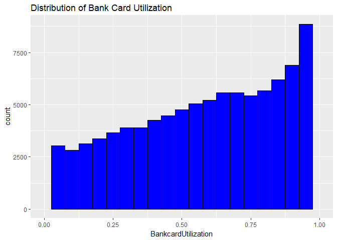<!-- -->

We observe an interesting trend from the above histogram. The distribution is relatively left skewed. We can't claim it to be strictly left skewed, becaue the tail is not long enough and counts are not significantly small on left tail. Being left skewed makes sense, because most of the borrowers might have almost maxed out their credit limits. As seen from the summary stats, 75 percent of the population have used almost 84 percent of their limit. Next, we filter out *NA* values for **BankCardUtilization** and limit it to 100 percent. The new dataset is called `` loan_Prosper_Rating_complete_BankCard ``.


Next, **Prosper Rating** might get affected by **InquiriesLast6Months**. The distribution for **InquiriesLast6Months** is right skewed as observed above in the figure titled `` Distribution of Inquiries Made in Last 6 months ``. The variable, `` loan_Prosper_Rating_complete_Inquirieslast6months  `` will be used to analyze relation between **ProsperRating** and **InquiriesLast6Months**.


 


Next factor which might affect the **ProsperRating** for a given borrower is **EstimatedLoss**. Since it is a numeric variable, we will start with its histogram.


```
##    Min. 1st Qu.  Median    Mean 3rd Qu.    Max.    NA's 
##   0.005   0.042   0.072   0.080   0.112   0.366   29084
```

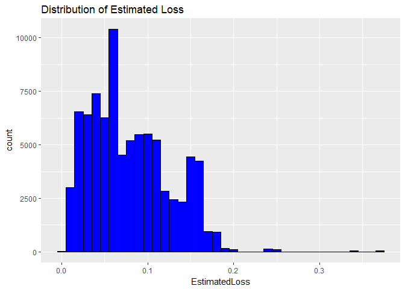<!-- -->

The distribution for **EstimatedLoss** is roughly right skewed, and has multiple peaks. Moreover, we need to filter out the *NA* values for **EstimatedLoss** to obtain a new dataset, `` loan_Prosper_Rating_complete_Estimated_loss ``. 


Next, we study the distribution for **DebtToIncomeRatio**. It is interpreted as ratio of total monthly payments towards loans to gross monthly income, and is a decisive factor in asessing the credibility of the borrower.


```
##    Min. 1st Qu.  Median    Mean 3rd Qu.    Max.    NA's 
##   0.000   0.140   0.220   0.276   0.320  10.010    8554
```

The mean is greater than median, suggesting a relatively right skewed distribution, demonstrated by the following histogram.

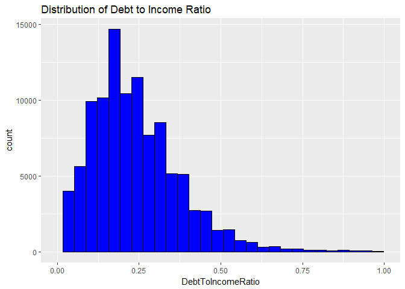<!-- -->

It has few peaks, but the overall behavior is right skewed. After filtering the *NA* values for **DebtToIncomeRatio**,  we obtain the dataset;`` loan_Prosper_Rating_complete_Debt_Incm_Ratio ``.


Last (for this project), another factor that might affect **ProsperScore** significantly is **OnTimeProsperPayments**. To begin with, we check its summary stats.


```
##    Min. 1st Qu.  Median    Mean 3rd Qu.    Max.    NA's 
##    0.00    9.00   15.00   22.27   32.00  141.00   91852
```
We can see significant number of *NA's*, which need to be filtered out, while doing the univariate analysis.

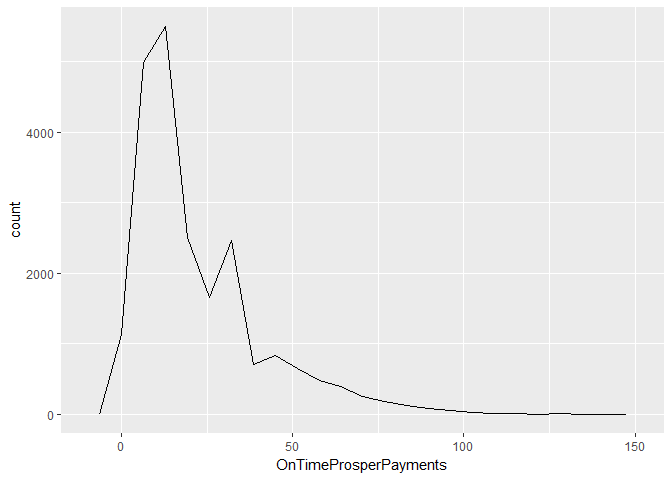<!-- -->

The data is not strictly continuous, but it does not qualify for a bar chart too. Therefore, it is possible to go for the option of histogram or frequency polygons. To observe the variation, we decrease the binwidth which gives us higher number of bins. Looking at the distribution, we observe right skewness, indicating that many borrowers have not made payments on time.


We did univariate analysis for the variable **ProsperRating** and variables, that might affect it. Using descriptive statistics for those variables, we defined new datasets, `` loan_Prosper_Rating_complete_BankCard ``, `` loan_Prosper_Rating_complete_Inquirieslast6months ``, `` loan_Prosper_Rating_complete_Estimated_loss ``,`` loan_Prosper_Rating_complete_Debt_Incm_Ratio  ``, and `` loan_Prosper_Rating_complete_Ontime_prosper ``. These datasets will be used to  explore relationship between **ProsperRating** and its possible predictors.

###Loan Amount and its Predictors
While borrowing money through Prosper platform, it is common for lenders and borrowers to decide on a suitable loan amount. The variable **LoanOriginalAmount** is affected by several factors. For present analysis, we study effect of **Income Range** and **Credit Rating**. 

First, we observe the distribution for **OriginalLoanAmount**. It is an integer, so histogram will be a suitable choice. 


```
##    Min. 1st Qu.  Median    Mean 3rd Qu.    Max. 
##    1000    4000    6500    8337   12000   35000
```

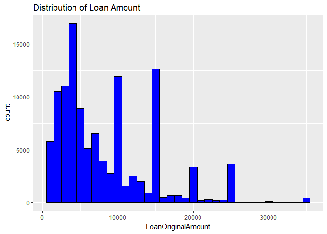<!-- -->

Since mean exceeds the median significantly, the distribution is expected to be right skewed, which is obvious from the histogram, other than couple of peaks. Moreover, we notice that it is quite rare for borrowers to ask for huge amount of loans through prosper.

Next, we study two variables that might affect the amount of loan granted to a borrower. It makes sense for the lender to gather information regarding the income of the borrower. To this end, we analyze the distribution for the variable,**IncomeRange**. 


```
## [1] "$0"             "$1-24,999"      "$100,000+"      "$25,000-49,999"
## [5] "$50,000-74,999" "$75,000-99,999" "Not displayed"  "Not employed"
```

Since it is defined as a categorical variable, we opt for the bar graph. Here, we want to investigate the relationship between **Loan Amount** and **Income Range**. Therefore, we filter out values such as "$0","Not displayed", and "Not employed".

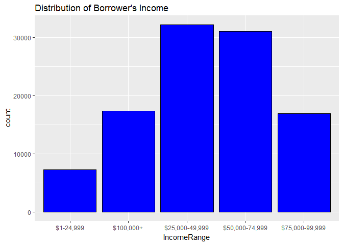<!-- -->

After filtering out unwanted values for Income, such as "Not Employed","Not Dispalyed",and "$0" we define a new variable, `` loan_incm_range_complete ``.


Another factor, that might affect **LoanAmount** significantly is **CreditGrade**. The distribution for **CreditGrade** was observed to be right skewed in the above section, titled "Distribution for Credit Grades Prior to 2009". We will filter the empty values for **CreditGrade**, and define a new variable; `` loan_incm_range_complete_credit_grade ``. This dataset will be used to study the relationship between **LoanAmount**,**Income Range**, and **CreditGrade** in the multivariate anlaysis section. 


### Loan Performance at State Level

In this section, we analyze the loan performance at state level, like percentage of defaulters in a  given state, etc. To this end we study variables, **StatedMonthlyIncome**, **Borrower State**, and **Loan Status**.  To begin with, we perform univariate analysis of **StatedMonthlyIncome**. Being a numeric variable, we investigate the histogram.


```
##    Min. 1st Qu.  Median    Mean 3rd Qu.    Max. 
##       0    3200    4667    5608    6825 1750000
```

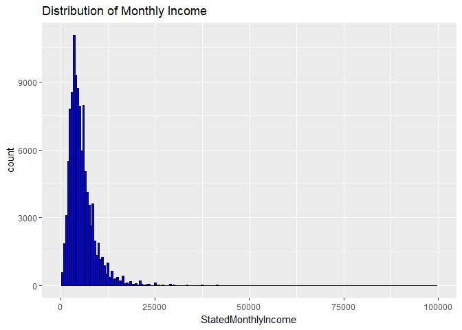<!-- -->

Since mean exceeds the median, the distribution is right skewed, as observed in the histogram.

Next, we study the **LoanStatus**. Since it is a categorical variable, we observe its bar graph.


```
##              Cancelled             Chargedoff              Completed 
##                      5                  11992                  38074 
##                Current              Defaulted FinalPaymentInProgress 
##                  56576                   5018                    205 
##   Past Due (>120 days)   Past Due (1-15 days)  Past Due (16-30 days) 
##                     16                    806                    265 
##  Past Due (31-60 days)  Past Due (61-90 days) Past Due (91-120 days) 
##                    363                    313                    304
```

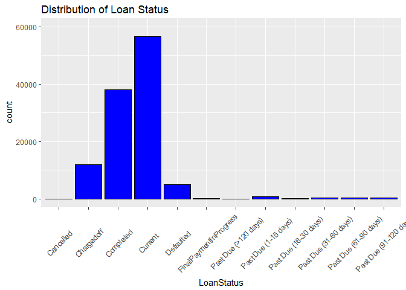<!-- -->

The bar graph suggests that majority of the loans have been paid on time. In subsequent sections, we will use these results to identify the state with the highest percentage of defaultors. 


We have presented univariate analysis for few selected variables from the Prosper loan datatset. Our analysis focussed mostly on the **BorrowerAPR** alongwith its predictors,**ProsperRating** and its predictors. We also tried to get an overview of distribution of **LoanAmount**, **IncomeRange**, and **LoanStatus**. Next, we use these results to conduct bivariate analysis.

##Bivariate Analysis

###Relation Between BorrowerAPR and its Predictors

To begin with, we study the effect of **CreditGrade** on **BorrowerAPR**. We use the datatset, `` loan_BorrowerAPR_complete_credit_grade `` to achieve this purpose.

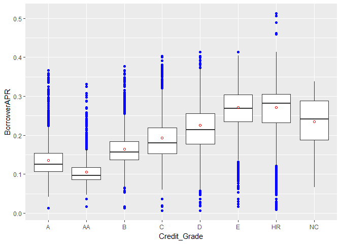<!-- -->

Here the red circle denotes mean value for **BorrowerAPR**. For a given **CreditGrade**, there is significant variation in **BorrowerAPR**, hence boxplot is a suitable choice. Here blue circles denote outliers, which are observed for every **CreditGrade**. The outliers denote points that lie beyond values; $Q3+(1.5 \times IQR)$ and $Q1-(1.5 \times IQR)$. The boxplot also helps us to observe the skewness in distribution of **BorrowerAPR** across different **CrediGrades**. As expected, the average APR charged to borrowers with poor credit grades is significantly higher than safe borrowers. It is worth adding that the distribution for **CreditGrade=HR**, distribution is left skewed, which might hint towards higher APR being charged for risky borrowers.  

Next, we analyze the relationship between **BorrowerAPR** and **ProsperRating**. Since **ProsperRating** is a categorical variable, we use the boxplot.

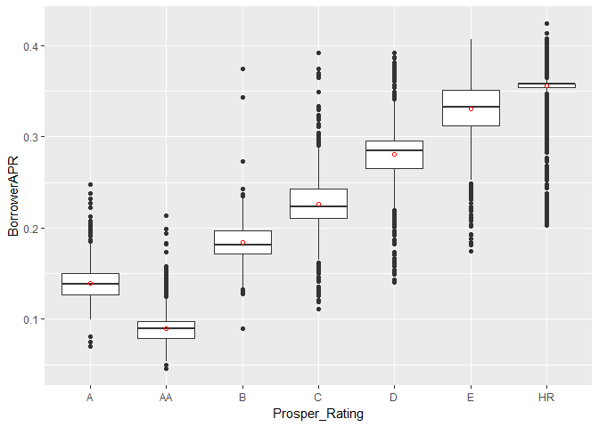<!-- -->

As expected, the APR for risky borrowers is significantly higher as compared to low risk borrowers. Similar to **CreditGrades**, we notice significant variation in APR as well as outliers. We observe that mean of the APR coincides with the median, therefore the **BorrowerAPR** is normally distributed across different **CreditGrades**.

To end with, we investigate the relation between **BorrowerAPR** and **InquiriesMadeWithinLast6Months**. We use the dataset, `` loan_BorrowerAPR_complete_Inquiries `` to obtain following scatterplot.


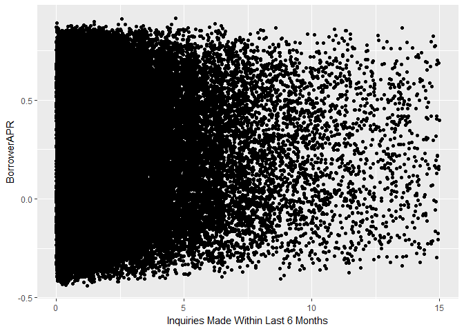<!-- -->

The correlation has been found to be 


```
## [1] 0.1461193
```


Using the scatterplot, we observe absence of linear correlation between **BorrowerAPR** and **InquiriesMadeWithinLast6Months**.

As a trial, let us bucket the variable **InquiriesMadeWithinLast6Months** and generate a boxplot between the bucketed variable and **BorrowerAPR**. To this end, we begin with bucketing the variable. For convenience, we use above dataset, `` loan_BorrowerAPR_complete_Inquiries ``.


```r
loan_BorrowerAPR_complete_Inquiries$bucket_inquiries <- cut(x=loan_BorrowerAPR_complete_Inquiries$InquiriesLast6Months,
  breaks=c(0,5,10,15,25),include.lowest = TRUE,ordered_result = TRUE)
```
Next, we generate the boxplot.

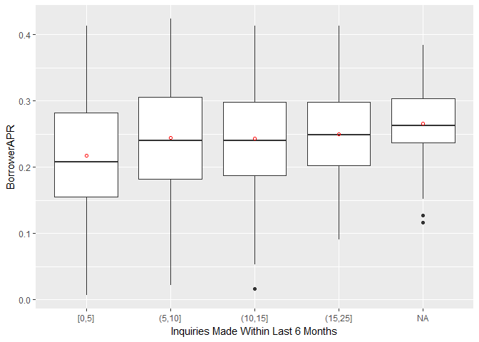<!-- -->


```r
loan_BorrowerAPR_complete_Inquiries %>% group_by(bucket_inquiries)%>%
 summarize(interquartile_range=IQR(BorrowerAPR))
```

```
## # A tibble: 5 × 2
##   bucket_inquiries interquartile_range
##              <ord>               <dbl>
## 1            [0,5]           0.1266600
## 2           (5,10]           0.1234700
## 3          (10,15]           0.1107300
## 4          (15,25]           0.0958400
## 5               NA           0.0663975
```

We can observe following trends from the boxplot. First, we notice that the borrowers who make more frequent inquiries to the bureau are charged higher APR on an average but the difference is not significant, as demonstrated by the scatterplot too. We expected the variation to be more significant, because people who make frequent inquiries to the bureau are desperate for money and their credit worthiness is low. Next, we observe decreasing trend in APR variation as we move right in the graph. It is easy to see that the IQR for the bucket `` [0,5] `` is 0.126660 which is significantly higher than the IQR for bucket `` (20,25] ``. 

To conclude, **BorrowerAPR** is affected by variables;` **CreditGrades**, and **ProsperRating**. Next, we perform similar analysis between **ProsperRating** and its potential contributors.

###Relation Between ProsperRating and its Predictors

First, we study the relation between **ProsperRating** and **BankCardUtilization**. To this end, we use the dataset, `` loan_Prosper_Rating_complete_BankCard ``. Since **ProsperRating** is a categorical variable, boxplot is a suitable choice.

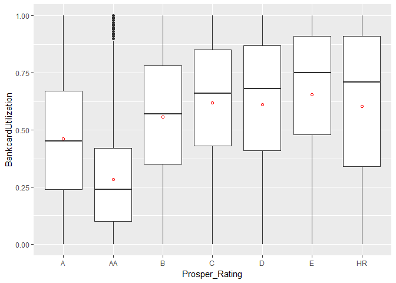<!-- -->

We observe few interesting trends from above boxplot. For the poor prosper grades, such as **B** and worse, the distribution of **BankCardUtilization** is left skewed. This seems reasonable, because risky borrowers might have utilized their cards to the limit. Next, we see some outliers for **ProsperRating=AA**. Mostly, people with good ratings have low BankCardUtilization percentage. One of the possible reasons for this outlier can be that few borrowers in good standing tend to use their credit cards (to earn Cash Back) and pay off their balance on  a regular basis. Therefore at a given point of time, they might have high balance on the card, which accounts for outliers. In the end, if we observe the mean **BankCardUtilization** across different **ProsperRating**, we notice a wiggly behavior. Therefore, we can't be sure that HighRisk borrowers must have higher **BankCardUtilizaiton** percentage.

Next, we explore the relationship between **ProsperRating** and **InquiriesLast6Months**. We use a boxplot to see the relation between categorical variable; **ProsperRating** and numeric variable; **InquiriesLast6Months**. The dataset, `` loan_Prosper_Rating_complete_Inquirieslast6months `` is used to obtain the boxplot.

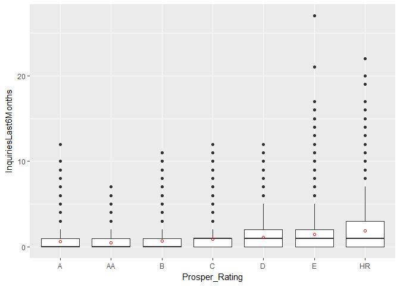<!-- -->

We observe following trends from the above boxplot. First, on an average the borrowers who have made frequent inquiries to the bureau have lower prosper rating, hence are more risky. 
Second, we see significant outliers for every value of **ProsperRating**. But the variation for safe borrowers, i.e. **ProsperRating=AA** is lower than other grades. It is expected, since borrowers in excellent credit rating tend not to make several inquiries to the bureau. Next, we also observe skewness in the distribution for **InquiriesLast6Months**. The mean is significantly higher than median in most of the cases. This can be attributed to the presence of significant number of outliers corresponding to each **ProsperRating**.

Next, we study the relation between **ProsperRating** and **EstimatedLoss**. We use the dataset, `` loan_Prosper_Rating_complete_Estimated_loss `` to obtain following boxplot.

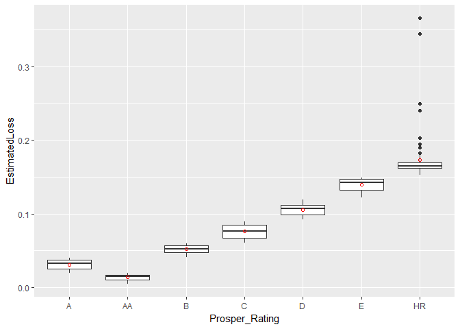<!-- -->

It is easy to observe that the mean **EstimatedLoss** is significantly higher for risky borrowers. This makes sense because the lenders will be cautious in giving money to high risk borrowers. The average **EstimatedLoss** for risky borrowers is close to 17 percent which is significantly higher than their safer counterparts(AA),close to 2.5 percent. Second, other than risky borrowers, we do not see any outliers for **ExpectedLoss**. It is possible that these outliers cause high skewness for High Risky borrowers.

Next, we use the dataset `` loan_Prosper_Rating_complete_Debt_Incm_Ratio `` to study the variation between **ProsperRating** and **DebtToIncomeRatio**. 

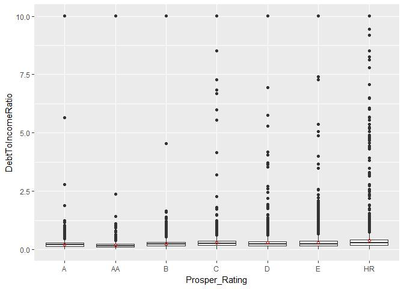<!-- -->

It is interesting to see presence of outliers for each **ProsperRating**. For safe borrowers, e.g. **A**,**B**, and **AA** outliers are not so prominent unlike their risky counterparts. For example, the risky borrowers have their outliers quite evenly spreadout. Moreover, we do not see much variation in the **DebtToIncomeRatio** across different values of **ProsperRating**. To conclude, **DebtToIncomeRatio** does not have  significant impact on **ProsperRating**. 

In the end, we investigate relation between **ProsperRating** and **OnTimeProsperPayments**. We use the dataset `` loan_Prosper_Rating_complete_Ontime_prosper `` to get following boxplot.

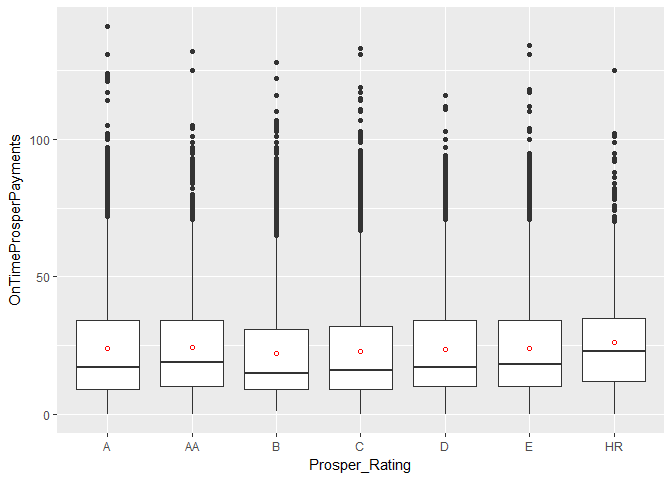<!-- -->


The above boxplot does not convey much relation between **OnTimeProsperPayments** and **ProsperRating**.The mean number of on time prosper payments is around 25 for every **ProsperRating**. But we see right skewness in the distribution for **OnTimeProsperPayments** for every rating. Therefore, for each rating we don't have many entries involving large number of prosper payments.

To summarise, we conclude that **ProsperRating** is most likely to be affected by **EstimatedLoss**, and **InquiriesLast6Months**.

### Defaulters in a Given State

To begin with, we identify top 5 rich and poor states. Since monthly income is right skewed, it makes sense to compare the median. The results are stored in the variable, `` monthly_income_state ``. 


Next, we identify the top rich and poor states using the dataset. It should be noted that this classificaion is based on this particular dataset and might not reflect true figures. The top 5 rich states are;


```
## # A tibble: 5 × 2
##   BorrowerState median_monthly_income
##          <fctr>                 <dbl>
## 1            DC              6250.000
## 2            MD              5833.333
## 3            NJ              5666.667
## 4            VA              5666.667
## 5            AK              5416.667
```


Similarly, the top 5 poor states include


```
## # A tibble: 5 × 2
##   BorrowerState median_monthly_income
##          <fctr>                 <dbl>
## 1            ID              3600.417
## 2            SD              3541.667
## 3            ME              3250.000
## 4            IA              3152.167
## 5            ND              2636.167
```


Next, it will be interesting to identify the state having highest percentage of 
defaulters.

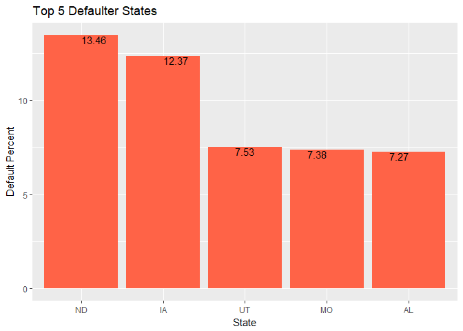<!-- -->

Almost 13 percent of loan takers from ND default,
which is the highest among all states (in this dataset). One possible reason for high default cases in ND can be attributed to the fact that average loan amount for *ND* exceeds the average income of residents. There can be other reasons too, such as residents tend to spend on other luxuries in life rather than paying their debt, etc. That will require more exhaustive invesigation and is possibly beyond scope of this project.

We can also visualize the default performance across diferent states using the `` maps() `` feature in `` R ``.

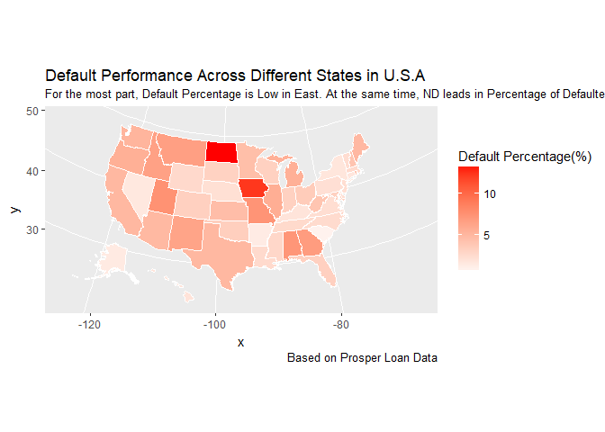<!-- -->


The above map gives us another representation for default data across the states in U.S. Overall the default rate is lower in the states on the east, but we have few exceptions. 

##Multivariate Analysis
##Relation between Loan Amount, Income Range, and Credit Grade


It will be interesting to see the behavior of Loan Amount vs. Credit Grade across different Income Ranges. To this end, we use the dataset, `` loan_incm_range_complete_credit_grade ``.

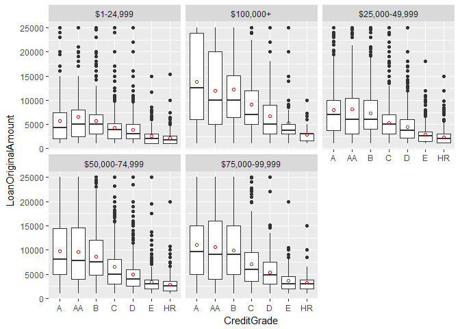<!-- -->

Here are some important observations from above boxplot. First, across every income range the average loan amount requested is lower for risky borrowers. It is expected for risky borrowers to get lower amount approved because of their low credit worthiness. The average loan approved for risky borrowers across every Income range is close to `$` 2500. Next, it is interestng to note that for low income range (`$`1-24,999), the borrowers with excellent credit rating (**AA**) get the highest loan amount approved on an average. Though they have low income, borrowers with excellent credit gain trust of lenders and seem to be favored while approving loan amount. Next, among affluent borrowers (i.e. high yearly incomes, such as `$`75000-99,999, `$`100000+), safe borrowers exhibit quite consistent behavior in the requested loan amonts. We do not observe outliers for them. On the contrary, risky borrowers do have outliers across every Income range. One possible explanation is that these borrowers tend to overspend and hence need additional funds. 


##Final 3 Plots and Summary

To recap, we analyzed the **Prosper loan** dataset. Selected variables related to Borrower information were studied. The goal is to identify variables that might affect **ProsperRating** and **BorrowerAPR**. In this section, we present three plots, which seem to be most informative.

###Plot 1
####Borrower APR vs. CreditGrade

Earlier we saw that risky borrowers are charged high APR. This can be due to their low credit worthiness. Before we plot the data again, it will be wise to convert the APR to percentage.  


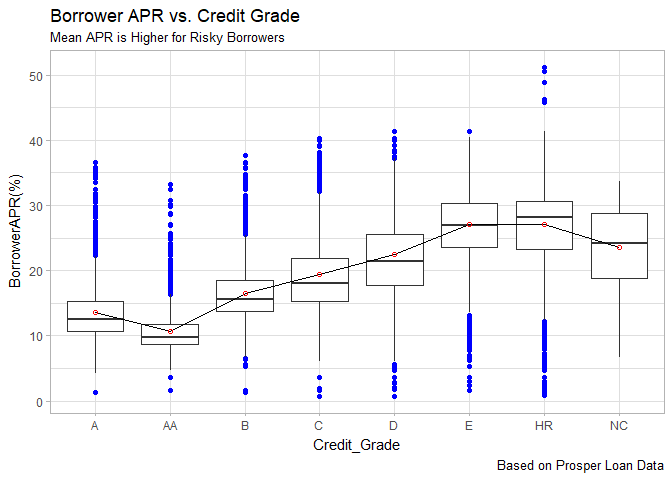<!-- -->


Apart from variation in APR for every CreditGrade, we observe significant trend in average APR across different CreditGrades. The average APR for risky borrowers is close to 27.5 percent, which is significantly higher than the APR for safe borrowers.

###Plot 2
####ProsperRating vs. EstimatedLoss

We use the dataset, `` loan_Prosper_Rating_complete_Estimated_loss `` to obtain following boxplot.


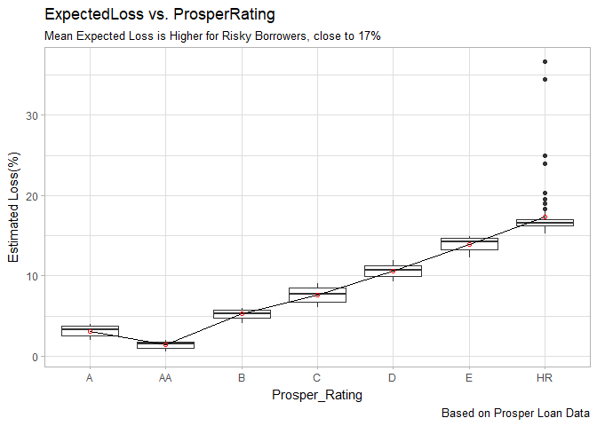<!-- -->

It is easy to observe that borrowers with higher **EstimatedLoss** do have lower **ProsperRating**, hence are more risky. The safe borrowers, (rating=AA) exhibit significanty low Estimated loss, 2.5 percent. To recap, **EstimatedLoss** does help to decide the **ProsperRating** for a given borrower.

###Plot 3
####Loan Amount vs. Credit Grade Across Different Income Ranges

Here, we observe performance of **LoanAmount** vs. **CreditGrade** across different Income Ranges. To this end, we use the dataset, ``loan_incm_range_complete_credit_grade ``.

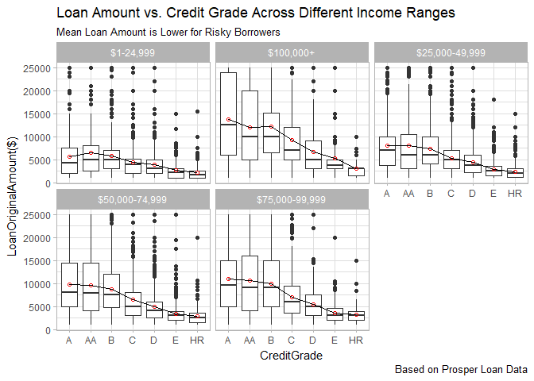<!-- -->

For each **IncomeRange**, we see a common trend; the loan amount approved is lower for risky borrowers. For each income range, the average loan amount for risky borrowers is observed to be 2500 dollars. As we observe, the loan amount decreases monotonically as credit grade worsens.

###Summary

To recapitulate, we analyzed the ProsperLoan Dataset. Our analysis was primarily focussed at identifying variables affecting **BorrowerAPR**, and **ProsperRating**. **BorrowerAPR** is a continuous variable, hence histogram is  suitable choice to analyze its distribution. Since it did contain significant number of NA's, missing values had to be eliminated before exploring its relation with other variables. 

We studied effect of **ProsperRating**, **CreditGrade**, and **InquiriesMadeWithinLast6Months** on **BorrowerAPR**. **CreditGrade** is not populated for listings after 2009, therefore, we had to handle lots of missing values before implementing our bivariate analyasis. While exploring the relation between **BorrowerAPR** and its potential predictors, we found out that **CreditGrade** and **ProsperRating** impact it significantly. On the other hand, the effect of  **InquiriesMadeWithinLast6Months** on **BorrowerAPR** is not remarkable.

Next, we studied the behavior of **ProsperRating** and its potential predictors. **ProsperRating** had several missing values, which had to be eliminated before using it for further analysis.

While conducting bivariate analysis between **ProsperRating** and its predictors, few interesting facts were discovered. First, **EstimatedLoss** for a given borrower significantly affects **ProsperRating**. This is expected, since borrowers who have been prompt in repaying entire loan amount on time ought to have higher **ProsperRating**. Second, borrowers who have made frequent inquiries to the Bureau tend to be desperate for money, hence their **ProsperRating** is affected adversely. On the other hand, variables such as **BankCardUtilization** and **DebtToIncomeRatio** appear not to affect **ProsperRating** significantly. We can't be so confident in this conclusion, because our results are based on this small dataset, hence, might not reflect the true figures.

Adding more, we also investigated loan performance at state level. The goal is to identify the state with highest percentage of defaulters in the given dataset. To this end, we identified top five rich and poor states. Since distribution for monthly income is right skewed, we used median as a perfomance measure. We found that **North Dakota(ND)** has highest percentage of defaulters. One possible reason for large number of default cases in **ND** can be attributed to the fact that average loan amount for *ND* exceeds the average income of residents. Identification of additional reasons may require thorough invesigation of this dataset as well as obtaining more data.

In the end, we performed multivariate analysis to study relation between **LoanAmount** and **CreditGrade** across various **IncomeRanges**. Across every income range the average loan amount requested is lower for risky borrowers. Next, among affluent borrowers (i.e. high yearly incomes) safe borrowers exhibit quite consistent behavior in the requested loan amonts. But risky borrowers exhibit too much variation in loan requested across every income range.

####Challenges and Future Work

First challenge was the substantial presence of missing values for most of the variables being analyzed. We were left with limited data while exploring bivariate as well as multivariate relation between variables. This might raise concerns on degree of generalization of conclusions obtained in our analysis.

Secondly, data for the variable **CreditGrade** is available only prior 2009. Therefore, we can't be certain about the effect of **CreditGrade** on **BorrowerAPR** after the year 2009. 

Regarding future work, it will be interesting to build a predictive model to predict the value of **BorrowerAPR**. Since it depends on continuous as well as categorical variables, binarizing categorical variables might be a suitable choice.


